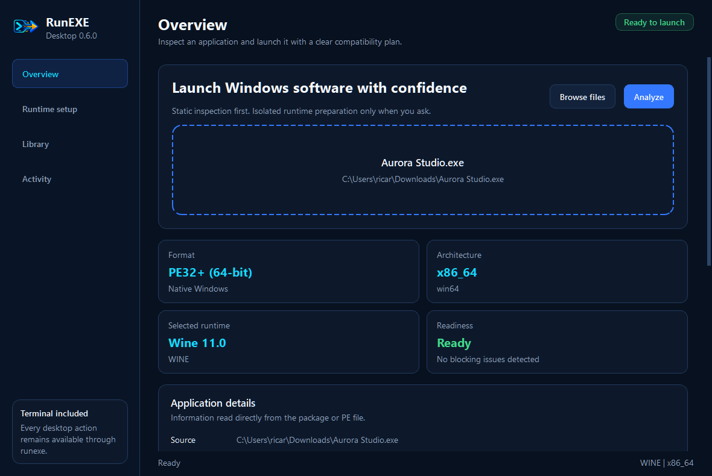

# RunEXE

Analyze Windows software and launch it on Linux through the best available Wine or Proton runtime,
from a scalable desktop application or the full command-line interface.

<p align="center">
  
</p>

  

See the detailed [changelog](CHANGELOG.md) for the latest release notes.

RunEXE inspects PE executables and AppX/MSIX packages before launch, reports likely compatibility concerns, discovers installed Wine and Proton runtimes, and creates an isolated per-application environment. Games prefer Proton when it is available; ordinary applications prefer Wine, with explicit overrides for either backend.

## Desktop interface

<p align="center">
  
</p>

The Qt desktop application is the easiest way to use RunEXE. It includes:

- A responsive overview with drag-and-drop file selection and clear readiness cards
- Background analysis and environment preparation, so the window stays responsive
- Automatic Wine/Proton selection with manual overrides when needed
- One-click isolated environment preparation and native Wine/Proton settings
- Persistent runtime preferences, keyboard shortcuts, and an in-app activity log
- A recent-application library that restores each app's own launch choices
- Managed-environment disk usage, folder access, and guarded cleanup
- Exportable JSON support reports for troubleshooting
- Live application output without blocking the interface
- Smooth wheel/touch scrolling, subtle page and metric transitions, and responsive action layouts
- Compatibility presets that detect known requirements such as Paint.NET's minimum Windows build

Install the optional desktop dependencies and open it with either entry point:

```bash
python -m pip install -e '.[gui]'
runexe-gui
# or
runexe gui
```

Before the first launch, `runexe doctor` checks the active distribution, libc,
package manager, Wine/Proton, graphical session, PySide6 plugins, and missing Qt
shared libraries. It is read-only and prints copy/paste repair commands for the
detected distribution.

Open and analyze a file immediately:

```bash
runexe-gui path/to/app.exe
# or
runexe gui path/to/app.exe
```

The GUI is intentionally a client of the same tested analysis and runtime services as the CLI;
it does not maintain a separate Wine or Proton implementation.

## ✅ Tested Applications

The following have been run through RunEXE with **no additional setup** beyond what the tool provisions automatically:

- Notepad++ (Native)
- Notepad++ (32-bit)
- PuTTY.exe (Native)
- KeePass (.NET)

More compatibility data is one of the long-term goals of the project (see [Roadmap](#-roadmap)).

## 🚀 Features

- **Defensive PE analysis** - bounded, read-only parsing of file-backed PE data (Wine is not required)
- **AppX/MSIX support** - extracts trusted package archives, reads `AppxManifest.xml`, and finds the declared application executable
- **Architecture detection** - x86 / x86_64 / ARM64, mapped to the correct `WINEARCH`
- **Import table analysis** - full DLL + function listing (`--imports`)
- **Subsystem parsing** - Windows GUI vs. Console vs. others
- **Embedded manifest extraction** - reads `RT_MANIFEST`, surfaces the requested execution level (e.g. `requireAdministrator`)
- **Version info parsing** - `VS_VERSIONINFO` (product name, publisher, version)
- **.NET / CLR detection** - via the COM descriptor data directory
- **Application classification** - conservatively distinguishes games from ordinary applications using Steam, engine, graphics, and input signals
- **Anti-cheat detection** - warns about Easy Anti-Cheat and BattlEye without treating per-title Proton support as a guaranteed failure
- **Compatibility reporting** - one consolidated report: recommended backend, required Winetricks verbs, blocking issues, and notes
- **Host detection** - checks host architecture, Wine and Winetricks availability/version
- **Proton discovery** - finds Valve, Experimental, GE, custom, Flatpak, Snap, and additional Steam-library installations
- **Real Proton execution** - creates isolated compat data and invokes Proton with its required Steam compatibility environment
- **Runtime control** - `--backend`, `--proton`, and `runexe backends` make selection predictable and inspectable
- **Wine prefix management** - creates and reuses a stable, per-app prefix automatically
- **Winetricks integration** - installs required runtimes (VC++ redistributables, D3D compiler/extension libs, OpenAL, .NET Framework) before launch
- **Native Wine execution** - launches from the application directory and preserves arguments, stdout, stderr, timeouts, and exit codes
- **Polished terminal UI** - readable launch plans, compact tables, clear status language, and a terminal mark derived from the project logo
- **Scalable desktop GUI** - responsive Qt layouts, drag and drop, runtime configuration, live logs, persistent preferences, and background tasks
- **Application library** - reopens recent software and restores its last launch choices without sharing custom prefixes between apps
- **Environment manager** - inventories RunEXE-owned Wine/Proton environments, reports disk use, opens their folders, and removes only validated managed paths
- **Support report export** - saves the current analysis, compatibility decision, host state, launch preset, environment inventory, and activity log as JSON
- **Graphics readiness** - identifies DirectX translation paths, probes Vulkan GPUs, and detects DXVK in Wine prefixes and Proton runtimes
- **Proton tuning presets** - applies temporary diagnostic, WineD3D, DXVK HUD, fsync, or ntsync overrides per application
- **Prefix backup and restore** - creates compressed snapshots before removal and restores only into an absent managed location
- **Expanded Wine configuration** - opens Wine settings, Registry Editor, Control Panel, installed-app management, or Explorer for an exact environment
- **User-level installation** - one command installs an isolated copy without changing the system Python, and a guarded uninstaller preserves application data
- **Desktop integration** - adds RunEXE and its logo to freedesktop application menus and the Open With list
- **Automation-friendly reports** - emits the full analysis and compatibility result as JSON

## 📋 Requirements

- Linux on an x86 or x86_64 host (the packaged Qt GUI requires x86_64; the CLI
  remains available on x86)
- Python 3.10+
- [Wine](https://www.winehq.org/), [Proton](https://github.com/ValveSoftware/Proton), or both (`analyze --no-host` needs neither)
- [Winetricks](https://github.com/Winetricks/winetricks) (optional, but needed for automatic dependency installation)
- [PySide6 Essentials](https://doc.qt.io/qtforpython-6/) (installed automatically with the `gui` extra)

## 🔧 Installation

### One-command user installation

Install the GUI directly from GitHub without cloning the repository or
installing pipx:

```bash
curl -fsSL https://raw.githubusercontent.com/CDJuaum/RunEXE/main/install.sh | sh
```

The installer creates an isolated virtual environment under
`$XDG_DATA_HOME/runexe/app`, exposes `runexe` and `runexe-gui` through
`~/.local/bin`, and adds RunEXE to the current user's desktop application menu.
It never runs `sudo` or installs system packages. Run `runexe doctor` afterward
for distribution-specific Wine, Proton, or GUI-library instructions.

For a console-only or menu-free installation:

```bash
curl -fsSL https://raw.githubusercontent.com/CDJuaum/RunEXE/main/install.sh | sh -s -- --cli-only
curl -fsSL https://raw.githubusercontent.com/CDJuaum/RunEXE/main/install.sh | sh -s -- --no-desktop
```

If you prefer to inspect downloaded scripts before running them, download
[`install.sh`](install.sh), review it, and execute `sh install.sh` locally.

### pipx installation

If pipx is already installed, it provides the cleanest package-managed setup:

```bash
pipx install "runexe[gui] @ git+https://github.com/CDJuaum/RunEXE.git"
runexe desktop install
```

Upgrade or uninstall that installation with:

```bash
pipx upgrade runexe
runexe desktop remove
pipx uninstall runexe
```

For an installation created by `install.sh`, rerun the same installer to
upgrade it. Remove its application files and desktop entry with:

```bash
curl -fsSL https://raw.githubusercontent.com/CDJuaum/RunEXE/main/uninstall.sh | sh
```

The uninstaller deliberately preserves recent-application history and all
Wine/Proton environments under `$XDG_DATA_HOME/runexe`. Manage those separately
from the Library page or with `runexe environments`.

### Development installation

```bash
git clone https://github.com/cdjuaum/runexe.git
cd runexe
python3 -m venv .venv
. .venv/bin/activate
python -m pip install --upgrade pip
python -m pip install -e '.[gui]'
runexe doctor
```

For a CLI-only installation, replace `.[gui]` with `.`. The console interface
does not import Qt and continues to work on headless hosts, SSH sessions, and
musl distributions where an official PySide6 wheel is unavailable.

### Distribution portability

RunEXE does not call `apt` internally or install system packages behind your
back. It detects `apt`, `dnf`, `pacman`, `zypper`, `apk`, `xbps-install`,
`emerge`, `eopkg`, and NixOS, then reports an appropriate command when a
runtime or GUI library is missing. These are typical prerequisites:

| Distribution family | Runtime packages |
| --- | --- |
| Debian, Ubuntu, Kali, Mint | `sudo apt install wine winetricks` |
| Fedora, RHEL derivatives | `sudo dnf install wine winetricks` |
| Arch, Manjaro | `sudo pacman -S wine winetricks` |
| openSUSE | `sudo zypper install wine winetricks` |
| Alpine | `sudo apk add wine winetricks` |
| Void | `sudo xbps-install -S wine winetricks` |
| Gentoo | `sudo emerge --ask app-emulation/wine-vanilla app-emulation/winetricks` |
| NixOS | `nix profile install nixpkgs#wineWowPackages.stable nixpkgs#winetricks` |

On Python 3.10-3.13 the PyPI GUI extra uses Qt 6.8.3 because its x86_64 wheel
supports glibc 2.28 and newer, covering more stable distributions than recent
Qt wheels. Python 3.14 selects a current PySide6 build, whose official wheel
requires newer glibc. PyPI does not publish a musllinux PySide6-Essentials
wheel. On Alpine or another musl system, install the distribution's PySide6
package and then install RunEXE without the `gui` extra; `runexe doctor`
verifies the resulting Qt installation. The CLI itself is pure Python and
works with either glibc or musl.

Wayland and X11 are selected before Qt loads. Automatic mode prefers the
current desktop session and keeps the other backend as a fallback. Override it
only when troubleshooting:

```bash
runexe-gui --platform wayland
runexe gui --platform xcb
RUNEXE_SOFTWARE_RENDERING=1 runexe-gui
```

Portable, Nix, and custom runtime layouts can be supplied without modifying
`PATH`:

```bash
RUNEXE_WINE_PATH=/path/to/wine runexe run app.exe
RUNEXE_WINETRICKS_PATH=/path/to/winetricks runexe run app.exe
RUNEXE_PROTON_PATH=/path/to/Proton runexe run game.exe
```

No compatibility frontend can guarantee that every Windows application works
on every distribution: Wine/Proton versions, GPU drivers, kernel features, and
the application itself still matter. RunEXE's portability guarantee is that
host differences are detected and explained instead of being encoded as
Debian-only assumptions or surfacing as unexplained Qt crashes.

## 📖 Usage

**Analyze an executable** - inspect it without running anything:

```bash
runexe analyze path/to/app.exe
```

AppX/MSIX packages and unpacked package directories are also supported. RunEXE
reads the package manifest, safely materializes the declared executable, and
launches that executable directly through the selected compatibility runtime:

```bash
runexe analyze Paint.msix
runexe run Paint.msix --no-deps
```

Add `--imports` / `-i` to list every imported function per DLL, not just counts:

```bash
runexe analyze path/to/app.exe --imports
```

Emit JSON for scripts, CI, or other tooling, or skip host checks for a purely static report:

```bash
runexe analyze path/to/app.exe --json
runexe analyze path/to/app.exe --no-host
```

**Run software** - analyze it, select Wine or Proton, prepare an isolated environment, and launch:

```bash
runexe run path/to/app.exe
```

Useful flags:

```bash
runexe run path/to/app.exe --verbose        # show prefix/backend/launch details
runexe run path/to/app.exe --timeout 60     # give up after 60s
runexe run path/to/app.exe --winver 10      # report Windows 10 to the app
runexe run path/to/app.exe --no-deps         # do not invoke Winetricks
runexe run path/to/app.exe --backend wine
runexe run path/to/game.exe --backend proton
runexe run path/to/game.exe --proton "Proton Experimental"
runexe run path/to/game.exe --proton ~/.steam/root/compatibilitytools.d/GE-Proton/proton
runexe run path/to/game.exe --backend proton --tuning diagnostics
runexe run path/to/game.exe --backend proton --tuning wined3d
```

Inspect what is installed and the order in which Proton builds will be selected:

```bash
runexe backends
```

Run the complete, non-destructive host readiness check (or emit JSON for bug
reports and automated setup):

```bash
runexe doctor
runexe doctor --no-gui
runexe doctor --json
runexe graphics
runexe graphics --json
```

List the local application library and RunEXE-owned environments:

```bash
runexe recent
runexe recent --json
runexe recent --prune-missing
runexe rerun APPLICATION_ID
runexe forget-recent APPLICATION_ID

runexe environments
runexe environments --json
runexe configure-environment wine:example-0123456789 --tool winecfg
runexe configure-environment wine:example-0123456789 --tool regedit
```

Environment deletion is intentionally explicit because a prefix can contain
Windows-side settings or save files. RunEXE accepts only the exact identifier
from `runexe environments`, validates that it is a direct child of a managed
RunEXE directory, requires `--yes`, and creates a restorable backup by default:

```bash
runexe remove-environment wine:example-0123456789 --yes
runexe backups
runexe restore-backup BACKUP_ID --yes
runexe remove-backup BACKUP_ID --yes
```

Use `--no-backup` only when you deliberately do not want the safety snapshot.
Backups live under `$XDG_DATA_HOME/runexe/backups`. Restore validates archive
paths and refuses to replace any existing environment.

Recent application state is stored under
`$XDG_STATE_HOME/runexe/applications.json` (normally
`~/.local/state/runexe/applications.json`). It is bounded, private to the local
machine, and never uploaded. The GUI's Activity page exports a support report
only when you deliberately choose a destination.

`--backend auto` is the default. It prefers Proton for detected games and Wine
for regular applications, then falls back to whichever runtime is available.
`--proton` implies the Proton backend. `RUNEXE_PROTON_PATH` can point to a custom
Proton directory or launcher that is outside Steam's normal locations.

Pass arguments to the Windows application after `--`:

```bash
runexe run path/to/app.exe -- --portable "C:\\data file.txt"
```

Wine prefixes live under `$XDG_DATA_HOME/runexe/prefixes`; Proton compat data
lives under `$XDG_DATA_HOME/runexe/proton`. `--prefix` overrides the relevant
location for either backend. Wine dependency provisioning is automatic. Proton
dependency changes are opt-in with `--deps` because modifying a
game-focused Proton prefix can reduce compatibility.

**Check the installed version:**

```bash
runexe version
```

## 🗺️ Roadmap

### v0.3.x

- [x] PE executable analysis
- [x] Architecture detection
- [x] Import analysis
- [x] .NET detection
- [x] Compatibility reporting
- [x] Host detection
- [x] Wine detection
- [x] Wine prefix management
- [x] Winetricks integration
- [x] Native Wine execution
- [x] Improve 32-bit Wine capability detection
- [x] Proton backend
- [x] Steam and custom Proton discovery
- [x] Automatic Proton environment configuration
- [x] AppX/MSIX inspection and launch support
- [x] Rich terminal UI and coordinated project identity

### v0.4.x

- [x] Native Qt desktop interface
- [x] Responsive overview, runtime setup, and activity pages
- [x] Background analysis and environment preparation
- [x] Automatic Wine and Proton configuration actions
- [x] Live non-blocking application output
- [x] Persistent desktop preferences and keyboard navigation
- [ ] Desktop notifications
- [x] Recent-application history and per-app launch presets
- [x] More Windows runtime detection
- [x] Better DirectX dependency detection
- [x] GPU/Vulkan capability detection
- [x] DXVK detection
- [x] More robust application classification
- [x] Improved Wine configuration

### v0.5.x

- [x] Recent-application library shared by GUI and CLI
- [x] One-command relaunch from saved CLI presets
- [x] Persistent per-app runtime, Windows version, dependency, prefix, and argument presets
- [x] Managed Wine/Proton environment inventory with disk usage
- [x] Guarded cleanup restricted to RunEXE-owned environment paths
- [x] Exportable GUI support reports
- [x] One-command isolated user installer and guarded uninstaller
- [x] Freedesktop application-menu entry, logo, and Open With registration
- [x] Optional Proton runtime tuning presets for advanced troubleshooting
- [x] Prefix backup and restore before destructive maintenance
- [x] Vulkan/GPU readiness reporting for DirectX translation

### Future

- [ ] Launch existing Steam titles by App ID
- [ ] More advanced compatibility scoring
- [ ] Native `.deb`, RPM, Flatpak, and AppImage packages
- [ ] Application database / community compatibility data

## 🛡️ Notes

- RunEXE does not modify the analyzed executable in any way - analysis is read-only.
- `runexe analyze` does not initialize Wine prefixes or otherwise mutate Wine state.
- AppX/MSIX archives are extracted into `$XDG_CACHE_HOME/runexe/packages` (or `~/.cache/runexe/packages`) for reuse. Package signatures are not verified; only run packages you trust.
- Package identity and Microsoft Store services are not recreated. Classic Win32 applications distributed inside AppX/MSIX may work, while UWP/Store-only features may still fail under Wine.
- Wine is a compatibility layer, **not a security sandbox**. Only run executables you trust; use a VM or a dedicated sandbox for untrusted software.
- Wine/Proton prefixes may contain application settings and save data. Inspect
  or back up important files before environment removal; RunEXE never removes
  the original EXE/AppX/MSIX source.
- Anti-cheat detection is a best-effort signal based on known import names (see `constants.py`); it is not exhaustive and deliberately does not attempt to detect wrapper/VM-based DRM such as Denuvo. [Proton support for EAC and BattlEye is enabled per title](https://partner.steamgames.com/doc/steamhardware/proton), so these detections are warnings rather than automatic blockers.
- Game detection is heuristic. Use `--backend wine` or `--backend proton` whenever you know which runtime the application needs.
- RunEXE launches Proton directly through its `proton run` interface with isolated compat data. Valve primarily designs Proton for use through Steam, so a particular title may still depend on Steam runtime services or launch configuration.
- Provided "AS IS" without warranty of any kind.

## 🤝 Contributing

Contributions are welcome! Feel free to open an issue or submit a Pull Request.

Install the development tools and run the full local verification suite:

```bash
python -m pip install -e '.[dev,gui]'
ruff check .
ruff format --check .
pytest
python -m build
```

## 📄 License

This project is licensed under the **LGPL-2.1** License - see the [LICENSE](LICENSE) file for details.

## 💬 Support

For support or questions, please open an issue on GitHub.
